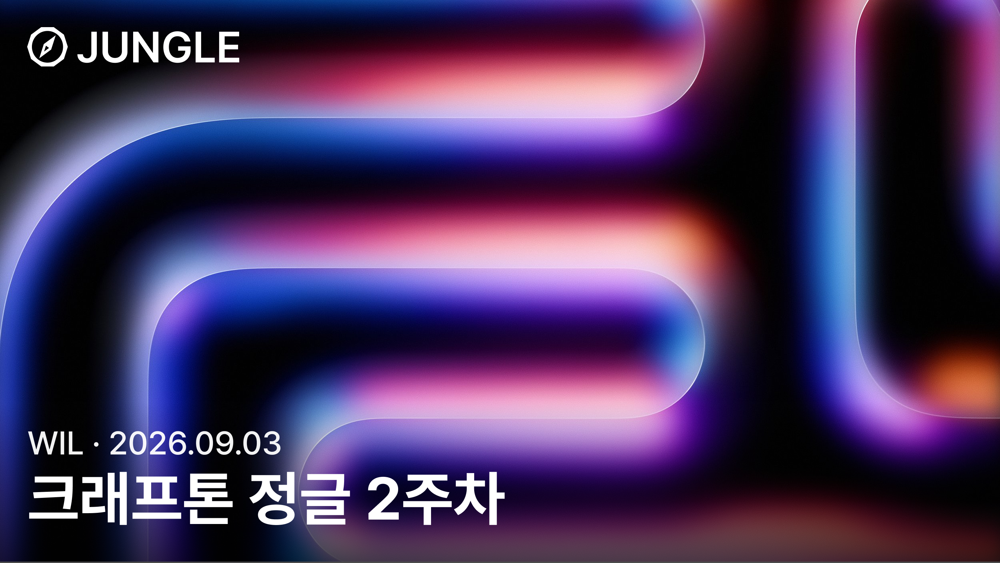
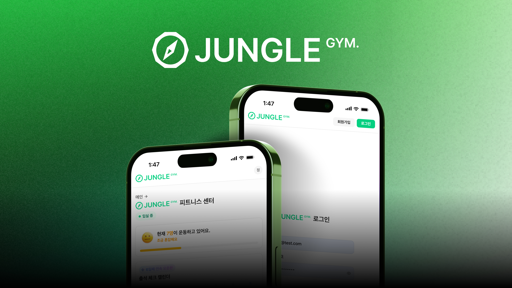

# Jungle_

  <strong><a href="./projects/">Projects(1)</a></strong> ·
  <strong><a href="./experiences/">Experiences(2)</a></strong> ·
  <strong><a href="./reviews/">Reviews(0)</a></strong> ·
  <strong><a href="./til/">TIL(4)</a></strong> ·
  <strong><a href="./wil/">WIL(2)</a></strong>

## Latest

<table>
  <tr>
    <td rowspan="2" width="40%" valign="top">
      
    </td>
    <td width="60%" valign="top">
      WIL · 2026.09.03 
      <strong>크래프톤 정글 2주차</strong> 
      Python 기초 문제부터 백트래킹, 시간 복잡도와 기수 정렬까지 학습한 2주차 기록.
    </td>
  </tr>
  <tr height="1">
    <td width="60%" height="1" valign="bottom">
      <strong><a href="./wil/2026-09-03-krafton-jungle-week-2/">글 읽기 →</a></strong>&nbsp;&nbsp;·&nbsp;&nbsp;
      <strong><a href="https://catisapple.github.io/Jungle_/wil/2026-09-03-krafton-jungle-week-2/">글만 보기 ↗</a></strong>
    </td>
  </tr>
  <tr>
    <td rowspan="2" width="40%" valign="top">
      
    </td>
    <td width="60%" valign="top">
      TIL · 2026.08.31 
      <strong>Big O를 처음 배우다</strong> 
      시간·공간 복잡도를 처음 배우고, Radix Sort를 직접 구현하며 막힌 지점을 해결한 기록.
    </td>
  </tr>
  <tr height="1">
    <td width="60%" height="1" valign="bottom">
      <strong><a href="./til/2026-08-31-big-o-and-radix-sort/">글 읽기 →</a></strong>
    </td>
  </tr>
  <tr>
    <td rowspan="2" width="40%" valign="top">
      
    </td>
    <td width="60%" valign="top">
      TIL · 2026.08.30 
      <strong>쉬는 날, 다음을 준비하다</strong> 
      Go와 클라우드를 연결할 주말 프로젝트를 구상하고, 기록의 필요성을 다시 생각한 하루.
    </td>
  </tr>
  <tr height="1">
    <td width="60%" height="1" valign="bottom">
      <strong><a href="./til/2026-08-30-planning-cloud-project/">글 읽기 →</a></strong>
    </td>
  </tr>
  <tr>
    <td rowspan="2" width="40%" valign="top">
      
    </td>
    <td width="60%" valign="top">
      TIL · 2026.08.29 
      <strong>14시간 동안 백트래킹 문제를 붙잡고 배운 것</strong> 
      재귀 구조를 이해하기 위해 한 문제를 끝까지 붙잡고 해결한 기록.
    </td>
  </tr>
  <tr height="1">
    <td width="60%" height="1" valign="bottom">
      <strong><a href="./til/2026-08-29-backtracking/">글 읽기 →</a></strong>
    </td>
  </tr>
  <tr>
    <td rowspan="2" width="40%" valign="top">
      
    </td>
    <td width="60%" valign="top">
      TIL · 2026.08.28 
      <strong>Python 기초 문제를 직접 풀어 본 기록</strong> 
      문자열, 배열, 딕셔너리, 완전 탐색, 재귀 문제를 풀며 막힌 점과 배운 점.
    </td>
  </tr>
  <tr height="1">
    <td width="60%" height="1" valign="bottom">
      <strong><a href="./til/2026-08-28-python-basic-problem-solving/">글 읽기 →</a></strong>
    </td>
  </tr>
  <tr>
    <td rowspan="2" width="40%" valign="top">
      
    </td>
    <td width="60%" valign="top">
      EXPERIENCE · 2026.08.29 
      <strong>무너진 기초를 다시 세우기 위해</strong> 
      부족함을 피하지 않고 기초부터 다시 쌓기 위해 정글에 들어온 이유.
    </td>
  </tr>
  <tr height="1">
    <td width="60%" height="1" valign="bottom">
      <strong><a href="./experiences/2026-08-29-why-i-joined-jungle/">글 읽기 →</a></strong>
    </td>
  </tr>
  <tr>
    <td rowspan="2" width="40%" valign="top">
      
    </td>
    <td width="60%" valign="top">
      WIL · 2026.08.27 
      <strong>크래프톤 정글 1주차</strong> 
      첫 미니 프로젝트에서 경험한 몰입과 팀워크, 발표 실패를 통해 배운 것.
    </td>
  </tr>
  <tr height="1">
    <td width="60%" height="1" valign="bottom">
      <strong><a href="./wil/2026-08-27-krafton-jungle-week-1/">글 읽기 →</a></strong>
    </td>
  </tr>
  <tr>
    <td rowspan="2" width="40%" valign="top">
      
    </td>
    <td width="60%" valign="top">
      EXPERIENCE · 2026.08.24 
      <strong>크래프톤 정글 첫 주</strong> 
      새로운 팀원들과 의미 있는 결과물을 만들며 시작한 정글 첫 주의 목표와 기록.
    </td>
  </tr>
  <tr height="1">
    <td width="60%" height="1" valign="bottom">
      <strong><a href="./experiences/2026-08-24-krafton-jungle-week-1/">글 읽기 →</a></strong>
    </td>
  </tr>
</table>

## Projects

<table>
  <tr>
    <td width="100%" valign="top">
      
       
      <strong>Jungle GYM</strong>&nbsp;&nbsp;&nbsp;&nbsp;
      <strong><a href="https://junglegym.club">Website</a></strong>&nbsp;
      <strong><a>&middot;</a></strong>&nbsp;
      <strong><a href="https://github.com/yongminkim0501/jungle-1">Github</a></strong>
       
    </td>
  </tr>
</table>
